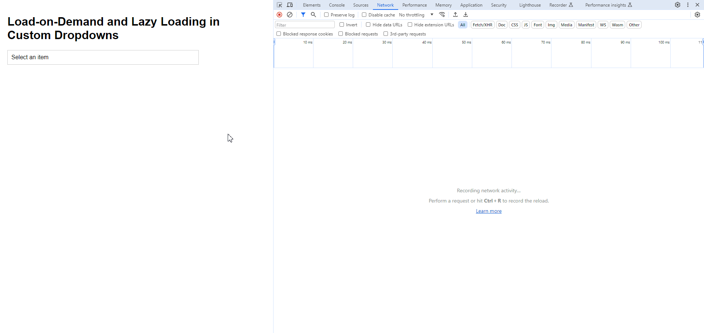

# Implementing Load-on-Demand and Lazy Loading in Custom Dropdowns | JavaScript | CodeLSC

When creating a custom dropdown that interacts with a large dataset from a remote data source, it is crucial to optimize the performance of the dropdown control. This article outlines a solution that combines load-on-demand and lazy loading techniques to efficiently load data into the dropdown, enhancing user experience and performance.

## Load-on-Demand and Lazy-Loading Demo



## Load-on-Demand Implementation

Load-on-demand is a technique where data is fetched dynamically as the dropdown is interacted with:

1. Initially, when the dropdown is opened, it fetches a set number of items from the remote source, populating the dropdown list with these items.
2. As the user scrolls through the list, additional data fetching is triggered, loading more items into the dropdown as needed.

## Lazy Loading

Lazy loading is an optimization technique that loads content as the user scrolls down, reducing the initial load time and memory usage:

1. As the user scrolls close to the bottom of the dropdown list, the system detects this and fetches additional items from the remote source.
2. These items are then appended to the dropdown list, ensuring a continuous and smooth scrolling experience.

## Implementation Example

Below is an example of how to implement these techniques in a custom dropdown:

```html
<div class="container">
    <h1>Custom Dropdown with Lazy Loading</h1>
    <div class="dropdown" id="customDropdown">
        <div class="dropdown-btn" onclick="toggleDropdown()">Select an item</div>
        <div class="dropdown-list" id="dropdownList">
            <!-- Dropdown items will be appended here -->
        </div>
    </div>
</div>

<script>
    // Global variables
    let currentPage = 1; // Track current page for lazy loading
    const limit = 20; // Limit of items to fetch per page
    const dropdownList = document.getElementById('dropdownList'); // Reference to the dropdown list

    // Function to fetch items from the API
    async function fetchItems() {
        const response = await fetch(`https://jsonplaceholder.typicode.com/photos?_page=${currentPage}&_limit=${limit}`);
        const items = await response.json();
        return items;
    }

    // Function to render items in the dropdown list
    function renderItems(items) {
        items.forEach(item => {
            const itemElement = createDropdownItem(item.id, item.title);
            dropdownList.appendChild(itemElement);
        });
    }

    // Function to create a dropdown item
    function createDropdownItem(id, title) {
        const itemElement = document.createElement('div');
        itemElement.classList.add('dropdown-item');
        itemElement.textContent = `${id} - ${title}`;
        return itemElement;
    }

    // Function to fetch and render items when the dropdown is opened
    async function fetchAndRenderItems() {
        const items = await fetchItems();
        renderItems(items);
    }

    // Function to toggle the display of the dropdown list
    function toggleDropdown() {
        if (dropdownList.style.display === 'block') {
            dropdownList.style.display = 'none';
        } else {
            dropdownList.style.display = 'block';
            if (dropdownList.children.length === 0) {
                fetchAndRenderItems(); // Fetch and render items if the dropdown list is empty
            }
        }
    }

    // Function to handle lazy loading when scrolling
    function handleDropdownScroll() {
        // Trigger lazy loading when the user scrolls close to the bottom of the dropdown list
        if ((dropdownList.scrollHeight - dropdownList.scrollTop) <= dropdownList.clientHeight) {
            currentPage++;
            fetchAndRenderItems();
        }
    }

    // Add scroll event listener to dropdownList
    dropdownList.addEventListener('scroll', handleDropdownScroll);
</script>
```

This implementation ensures that data is loaded efficiently on demand, providing a responsive and seamless user experience, especially when dealing with large datasets.

## Additional References

- [MDN Web Docs - Fetch API](https://developer.mozilla.org/en-US/docs/Web/API/Fetch_API)
- [MDN Web Docs - Element: scroll event](https://developer.mozilla.org/en-US/docs/Web/API/Element/scroll_event)
- [MDN Web Docs - Intersection Observer API](https://developer.mozilla.org/en-US/docs/Web/API/Intersection_Observer_API) (for more advanced lazy loading scenarios)

# CodeLSC

---

# 🚀 **Welcome to CodeLSC - Your Ultimate Coding Hub!**

Embark on a coding journey with **CodeLSC**, your destination for insightful tutorials on **Angular**, **JavaScript**, **HTML**, **CSS**, and **Blazor**. From tackling event handling to crafting interactive web elements, we've got your coding adventure covered. Subscribe now for a front-row seat to the dynamic world of web development!

## 🌐 **Explore Further:**
Visit our YoutTube: [CodeLSC Channel](https://youtu.be/mw8vsBy-NG8?si=0iutLmnwAV-NHuiM) and website: [CodeLSC Blog](https://codelsc.blogspot.com/) for additional resources, articles, and more!
