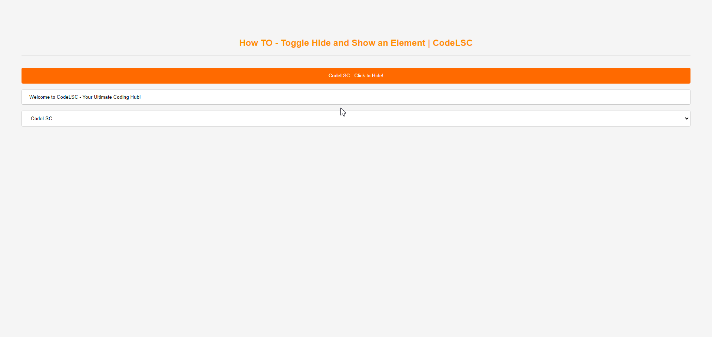

[](https://www.youtube.com/@codelsc/videos)

# How TO - Toggle Hide and Show an Element | CodeLSC

In this article, we will learn how to toggle between hiding and showing an HTML `input` and `select` elements using JavaScript.



## Step 1: Add HTML

First, we need to add the HTML elements that we want to show and hide. Here's an example:

```html
<button id="toggleBtn" onclick="ToggleFunction()">CodeLSC - Click to Hide!</button>
<input type="text" id="myInput" value="Welcome to CodeLSC - Your Ultimate Coding Hub!">
<select id="mySelect">
    <option value="option1">CodeLSC</option>
    <option value="option2">YouTube</option>
    <option value="option3">Instagram</option>
</select>
```

In the above code, we have a button, an `input` element, and a `select` element. When the button is clicked, it will trigger the `ToggleFunction()` JavaScript function.

## Step 2: Add JavaScript

Next, we add the JavaScript function that will toggle the visibility of the `input` and `select` elements:

```javascript
function ToggleFunction() {
    var inputElement = document.getElementById("myInput");
    var selectElement = document.getElementById("mySelect");
    var toggleButton = document.getElementById("toggleBtn");
    if (inputElement.style.display === "none") {
        inputElement.style.display = "block";
        selectElement.style.display = "block";
        toggleButton.innerHTML = "CodeLSC - Click to Hide!";
    } else {
        inputElement.style.display = "none";
        selectElement.style.display = "none";
        toggleButton.innerHTML = "CodeLSC - Click to Show!";
    }
}
```

In the `ToggleFunction()` function, we first get a reference to the `input` and `select` elements using their IDs. Then, we check the current display style of the elements. If it's set to `"none"`, we change it to `"block"` to show the elements. Otherwise, we set it to `"none"` to hide the elements. The button text also changes based on the visibility of the elements.

And that's it! You can now toggle the visibility of an HTML `input` and `select` elements with a click of a button.

## Try it Yourself

You can try this example yourself in your own HTML file. Just copy the HTML and JavaScript code into your file, open it in a web browser, and click the button to see the `input` and `select` elements show and hide.

Happy coding!

---

# CodeLSC

# 🚀 **Welcome to CodeLSC - Your Ultimate Coding Hub!**

Embark on a coding journey with **CodeLSC**, your destination for insightful tutorials on **Angular**, **JavaScript**, **HTML**, **CSS**, and **Blazor**. From tackling event handling to crafting interactive web elements, we've got your coding adventure covered. Subscribe now for a front-row seat to the dynamic world of web development!

## 🌐 **Explore Further:**
Visit our YoutTube: [CodeLSC Channel](https://youtu.be/mw8vsBy-NG8?si=0iutLmnwAV-NHuiM) and website: [CodeLSC Blog](https://codelsc.blogspot.com/) for additional resources, articles, and more!